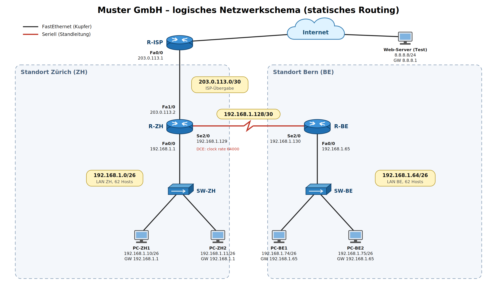
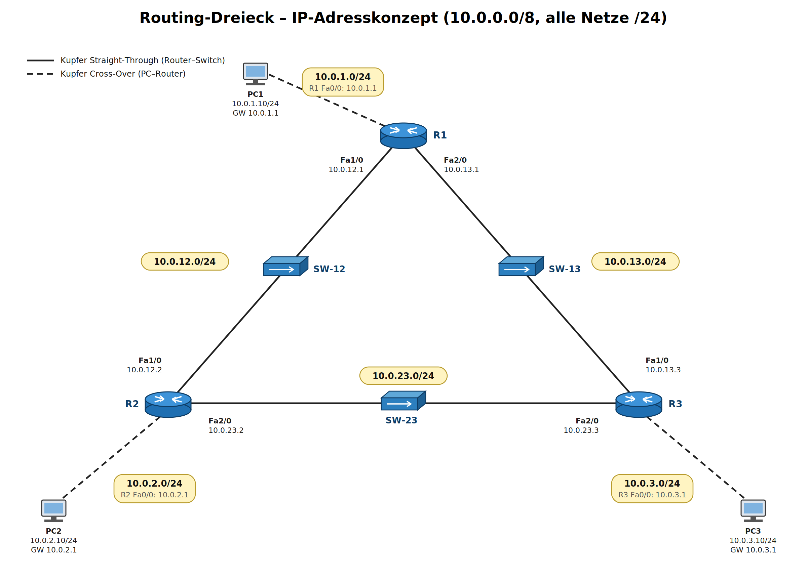

# M129 UB5 - Subnetze mit Router verbinden (Routing)

**Modul:** M129, Unterrichtsblock 5
**Tools:** Cisco Packet Tracer, IP Calculator, Wireshark

---

## Auftrag 1: Routing verstehen (KI als Coach)

Hier meine Zusammenfassung von dem, was ich mir erklären lassen habe:

**Wie kommen Daten von einem Netz in ein anderes?**
Ein PC schaut zuerst mit seiner Subnetzmaske, ob das Ziel im eigenen Netz liegt. Wenn ja, schickt er das Paket direkt (ARP auf die Ziel-MAC). Wenn nein, schickt er das Paket an sein Standardgateway, also an den Router. Der Router schaut die Ziel-IP an, sucht in seiner Routingtabelle den passenden Eintrag und schickt das Paket über das richtige Interface weiter, entweder direkt ins Zielnetz oder an den nächsten Router (Next Hop). Dabei werden die MAC-Adressen bei jedem Hop neu gesetzt, die IP-Adressen bleiben gleich und die TTL wird um 1 reduziert.

**Wann reicht ein Switch nicht mehr aus?**
Sobald Geräte in unterschiedlichen Subnetzen miteinander reden müssen. Ein Switch arbeitet auf Layer 2 und kennt nur MAC-Adressen, er kann also keine Pakete zwischen IP-Netzen weiterleiten. Ausserdem wird bei grossen Netzen ohne Unterteilung die Broadcast-Domäne zu gross.

**Weshalb braucht es einen Router, was ist Routing?**
Der Router verbindet Subnetze und trennt Broadcast-Domänen. Routing ist der Vorgang, bei dem der Router für jedes Paket anhand der Ziel-IP-Adresse den besten Weg zum Zielnetz bestimmt und das Paket entsprechend weiterleitet.

**Unterschied Switching und Routing**

| | Switching | Routing |
|---|---|---|
| OSI-Layer | 2 (Sicherungsschicht) | 3 (Vermittlungsschicht) |
| Adresse | MAC-Adresse | IP-Adresse |
| Tabelle | MAC-Adresstabelle (lernt selber) | Routingtabelle (statisch oder dynamisch) |
| Bereich | innerhalb eines Subnetzes | zwischen Subnetzen |
| Broadcasts | werden weitergeleitet | werden blockiert |

**Welche Infos braucht ein Router?**
Zielnetz mit Subnetzmaske, Next Hop (oder direkt angeschlossen), das Ausgangsinterface und eine Metrik (wie "weit" das Ziel ist). Ausserdem braucht jedes seiner Interfaces eine IP-Adresse im jeweiligen Subnetz.

**Was ist eine Routingtabelle?**
Die Liste, in welcher der Router nachschaut, wohin er ein Paket schicken muss. Passen mehrere Einträge, gewinnt immer der spezifischste Eintrag (längste Präfix, also z.B. /24 vor /16 vor /0).

**Was bezweckt eine Defaultroute?**
Die Defaultroute 0.0.0.0/0 passt auf jede Zieladresse und wird genommen, wenn kein spezifischerer Eintrag existiert. Typisch zeigt sie Richtung Internet (ISP). So muss man nicht jedes Netz der Welt eintragen und die Routingtabelle bleibt übersichtlich.

**Statisches vs. dynamisches Routing**
Bei statischem Routing trägt der Admin jede Route von Hand ein. Bei dynamischem Routing tauschen die Router ihre Routen mit einem Routingprotokoll (z.B. RIP, OSPF) selber aus und passen sich bei Ausfällen automatisch an. Mehr dazu in Teil 2 weiter unten.

---

## Auftrag 1: Routingtabelle RT1 (D1G)

Die Interfaces von RT1 sind im Bild nicht benannt, darum habe ich sie selber so bezeichnet:
eth0 = 172.16.0.0/16, eth1 = Richtung RT2, eth2 = Richtung RT3, eth3 = Richtung RT5, eth4 = Richtung RT7.

Metrik nach TBZ-Theorie: direkt angeschlossen = 0, für jeden weiteren Router +1, Defaultroute = unknown.

| Zielnetz + Netzmaske | Next Hop | Metric (Hop Count) | Interface |
|---|---|---|---|
| 172.16.0.0/16 (255.255.0.0) | direkt | 0 | eth0 |
| 172.31.1.0/30 (255.255.255.252) | direkt | 0 | eth1 |
| 172.31.1.4/30 (255.255.255.252) | direkt | 0 | eth2 |
| 172.31.1.8/30 (255.255.255.252) | direkt | 0 | eth3 |
| 32.160.3.12/30 (255.255.255.252) | direkt | 0 | eth4 |
| 172.24.1.0/24 (255.255.255.0) | 172.31.1.1 (RT2) | 1 | eth1 |
| 172.24.2.0/24 (255.255.255.0) | 172.31.1.5 (RT3) | 1 | eth2 |
| 172.24.3.0/24 (255.255.255.0) | 172.31.1.9 (RT5) | 1 | eth3 |
| 172.31.1.12/30 (255.255.255.252) | 172.31.1.9 (RT5) | 1 | eth3 |
| 172.25.0.0/16 (255.255.0.0) | 172.31.1.9 (RT5) | 2 | eth3 |
| 0.0.0.0/0 (0.0.0.0) | 32.160.3.14 (RT7) | unknown | eth4 |

Bemerkungen:
- 172.25.0.0/16 hat Metrik 2, weil das Paket über RT5 und dann noch RT6 muss.
- Die IP-Adressen von RT1 selber sind im Bild nicht angegeben, logisch wären es die jeweils andere Hostadresse der /30 Netze (172.31.1.2, .6, .10 und 32.160.3.13).
- 32.160.3.12/30 ist eine öffentliche Adresse, RT7 ist also der Übergang ins Internet, darum zeigt die Defaultroute dorthin.

---

## Praxisaufgabe: Statisches Routing Muster GmbH (ZH / BE)



### Subnetting

Basis: 192.168.1.0/24

- ZH: 50 Arbeitsplätze + 1 Router-Interface = 51 Adressen -> nächste 2er Potenz ist 64 -> /26 (62 Hosts, 11 Reserve)
- BE: 40 Arbeitsplätze + 1 Router-Interface = 41 Adressen -> 64 -> /26 (62 Hosts, 21 Reserve)
- Standleitung ZH-BE: 2 Router -> /30

| Netz | Netzadresse | Maske | Hostbereich | Broadcast | Gateway |
|---|---|---|---|---|---|
| LAN ZH | 192.168.1.0 | /26 (255.255.255.192) | .1 - .62 | 192.168.1.63 | 192.168.1.1 |
| LAN BE | 192.168.1.64 | /26 (255.255.255.192) | .65 - .126 | 192.168.1.127 | 192.168.1.65 |
| Standleitung | 192.168.1.128 | /30 (255.255.255.252) | .129 - .130 | 192.168.1.131 | - |
| frei (Reserve) | 192.168.1.132 - .255 | | | | |

Für den Zusatzauftrag (Internet) braucht es noch ein Übergabenetz zum Provider. Das ist in der Realität ein öffentliches Netz vom ISP, darum nehme ich 203.0.113.0/30 (Dokumentations-Adressbereich, R-ZH = .2, ISP = .1). Als "Internet" hängt am ISP-Router noch ein Test-Server 8.8.8.8/24 (R-ISP Fa1/0 = 8.8.8.1).

### Geräte und Adressen

| Gerät | Interface | IP / Maske | Gateway |
|---|---|---|---|
| R-ZH | Fa0/0 | 192.168.1.1/26 | - |
| R-ZH | Se2/0 (DCE) | 192.168.1.129/30 | - |
| R-ZH | Fa1/0 (Zusatz) | 203.0.113.2/30 | - |
| R-BE | Fa0/0 | 192.168.1.65/26 | - |
| R-BE | Se2/0 | 192.168.1.130/30 | - |
| PC-ZH1 / PC-ZH2 | Fa0 | 192.168.1.10 / .11 /26 | 192.168.1.1 |
| PC-BE1 / PC-BE2 | Fa0 | 192.168.1.74 / .75 /26 | 192.168.1.65 |
| R-ISP | Fa0/0 / Fa1/0 | 203.0.113.1/30 / 8.8.8.1/24 | - |
| Web-Server | Fa0 | 8.8.8.8/24 | 8.8.8.1 |

### Nachbau in Packet Tracer

- Router und Switch jeweils als PT-Empty, vorher Netzschalter aus.
- Router: Slot 0 PT-ROUTER-NM-1CFE (Fa0/0, LAN), Slot 1 PT-ROUTER-NM-1CFE (Fa1/0, nur R-ZH für Internet), Slot 2 PT-ROUTER-NM-1S (Se2/0, Standleitung).
- Switch: 3x PT-SWITCH-NM-1CFE (1 Uplink zum Router + 2 PCs).
- Verkabelung: Router-Switch und Switch-PC mit Copper Straight-Through, Router-Router mit Serial DCE (DCE-Ende an R-ZH, dort muss die Clock Rate gesetzt werden).

### Router-Konfiguration (CLI)

**R-ZH**
```
enable
configure terminal
hostname R-ZH
interface FastEthernet0/0
 ip address 192.168.1.1 255.255.255.192
 no shutdown
interface Serial2/0
 ip address 192.168.1.129 255.255.255.252
 clock rate 64000
 no shutdown
interface FastEthernet1/0
 ip address 203.0.113.2 255.255.255.252
 no shutdown
exit
ip route 192.168.1.64 255.255.255.192 192.168.1.130
ip route 0.0.0.0 0.0.0.0 203.0.113.1
end
copy running-config startup-config
```

**R-BE**
```
enable
configure terminal
hostname R-BE
interface FastEthernet0/0
 ip address 192.168.1.65 255.255.255.192
 no shutdown
interface Serial2/0
 ip address 192.168.1.130 255.255.255.252
 no shutdown
exit
ip route 0.0.0.0 0.0.0.0 192.168.1.129
end
copy running-config startup-config
```
R-BE braucht nur eine Defaultroute Richtung ZH, weil sowohl das LAN ZH als auch das Internet über R-ZH laufen. Ohne Internet würde auch `ip route 192.168.1.0 255.255.255.192 192.168.1.129` reichen.

**R-ISP (nur für die Simulation)**
```
interface FastEthernet0/0
 ip address 203.0.113.1 255.255.255.252
 no shutdown
interface FastEthernet1/0
 ip address 8.8.8.1 255.255.255.0
 no shutdown
exit
ip route 192.168.1.0 255.255.255.0 203.0.113.2
```
In der Realität würde der ISP keine Route auf private Adressen machen, sondern R-ZH würde NAT machen (private Adressen auf die öffentliche 203.0.113.2 übersetzen). Für die Übung in Packet Tracer reicht die Rückroute.

### Routingtabellen

**R-ZH**

| Zielnetz | Next Hop | Metric | Interface |
|---|---|---|---|
| 192.168.1.0/26 | direkt | 0 | Fa0/0 |
| 192.168.1.128/30 | direkt | 0 | Se2/0 |
| 203.0.113.0/30 | direkt | 0 | Fa1/0 |
| 192.168.1.64/26 | 192.168.1.130 | 1 | Se2/0 |
| 0.0.0.0/0 | 203.0.113.1 | unknown | Fa1/0 |

**R-BE**

| Zielnetz | Next Hop | Metric | Interface |
|---|---|---|---|
| 192.168.1.64/26 | direkt | 0 | Fa0/0 |
| 192.168.1.128/30 | direkt | 0 | Se2/0 |
| 0.0.0.0/0 | 192.168.1.129 | unknown | Se2/0 |

### Testprotokoll

| Nr | Test | Von | Nach | Erwartet | Resultat |
|---|---|---|---|---|---|
| 1 | ping (gleiches LAN) | PC-ZH1 | PC-ZH2 192.168.1.11 | Reply | |
| 2 | ping (gleiches LAN) | PC-BE1 | PC-BE2 192.168.1.75 | Reply | |
| 3 | ping Gateway | PC-ZH1 | 192.168.1.1 | Reply | |
| 4 | ping Gateway | PC-BE1 | 192.168.1.65 | Reply | |
| 5 | ping Standleitung | R-ZH | 192.168.1.130 | Reply | |
| 6 | ping Standort | PC-ZH1 | PC-BE1 192.168.1.74 | Reply (erster ev. Timeout wegen ARP) | |
| 7 | ping Standort | PC-BE2 | PC-ZH2 192.168.1.11 | Reply | |
| 8 | tracert | PC-ZH1 | 192.168.1.74 | 192.168.1.1 -> 192.168.1.130 -> 192.168.1.74 | |
| 9 | ping Internet | PC-BE1 | 8.8.8.8 | Reply | |
| 10 | tracert Internet | PC-BE1 | 8.8.8.8 | 192.168.1.65 -> 192.168.1.129 -> 203.0.113.1 -> 8.8.8.8 | |

**Noch zu ergänzen:** Resultate aus Packet Tracer eintragen und Screenshots der Pings/tracert einfügen.

---

## Praxisaufgabe: Statisch versus Dynamisch

### Teil 1: IP-Adresskonzept und Nachbau



Privater Class-A Bereich 10.0.0.0/8, alle Netze /24. Die LAN-Netze haben die Nummer vom Router (10.0.**1**.0 bei R1), die Verbindungsnetze die Nummern der beiden Router (10.0.**12**.0 zwischen R1 und R2). Die Router-Adresse im Verbindungsnetz ist jeweils die Router-Nummer (R2 = .2), so sieht man sofort, welches Interface zu welchem Router gehört.

| Netz | Netzadresse | Maske | Zweck |
|---|---|---|---|
| LAN 1 | 10.0.1.0 | /24 (255.255.255.0) | PC1 an R1 |
| LAN 2 | 10.0.2.0 | /24 | PC2 an R2 |
| LAN 3 | 10.0.3.0 | /24 | PC3 an R3 |
| Link R1-R2 | 10.0.12.0 | /24 | über SW-12 |
| Link R1-R3 | 10.0.13.0 | /24 | über SW-13 |
| Link R2-R3 | 10.0.23.0 | /24 | über SW-23 |

| Gerät | Fa0/0 (LAN) | Fa1/0 | Fa2/0 |
|---|---|---|---|
| R1 | 10.0.1.1 | 10.0.12.1 (SW-12) | 10.0.13.1 (SW-13) |
| R2 | 10.0.2.1 | 10.0.12.2 (SW-12) | 10.0.23.2 (SW-23) |
| R3 | 10.0.3.1 | 10.0.13.3 (SW-13) | 10.0.23.3 (SW-23) |

| PC | IP | Maske | Standardgateway |
|---|---|---|---|
| PC1 | 10.0.1.10 | 255.255.255.0 | 10.0.1.1 |
| PC2 | 10.0.2.10 | 255.255.255.0 | 10.0.2.1 |
| PC3 | 10.0.3.10 | 255.255.255.0 | 10.0.3.1 |

**Nachbau:**
- Router PT-Empty mit 3x PT-ROUTER-NM-1CFE, Switch PT-Empty mit 2x PT-SWITCH-NM-1CFE (vorher jeweils Netzschalter aus).
- PC direkt an Router mit Copper Cross-Over, Router an Switch mit Copper Straight-Through.
- Hinweis: Die Vorgabe sagt Gigabit-Kupfer, die vorgegebenen Module NM-1CFE sind aber FastEthernet. Ich habe mich an die Module gehalten, mit NM-1CGE wäre es Gigabit (Interfaces heissen dann GigabitEthernet statt FastEthernet), am Routing ändert das nichts.

**Grundkonfiguration R1** (R2 und R3 gleich mit ihren Adressen aus der Tabelle):
```
enable
configure terminal
hostname R1
interface FastEthernet0/0
 ip address 10.0.1.1 255.255.255.0
 no shutdown
interface FastEthernet1/0
 ip address 10.0.12.1 255.255.255.0
 no shutdown
interface FastEthernet2/0
 ip address 10.0.13.1 255.255.255.0
 no shutdown
end
copy running-config startup-config
```

**Test Teil 1:** ping von jedem PC auf sein Gateway (PC1 -> 10.0.1.1 usw.) und von jedem Router auf die direkten Nachbarn (R1 -> 10.0.12.2 und 10.0.13.3). Das muss schon ohne Routing gehen, weil alles direkt angeschlossen ist. PC1 -> PC2 geht in diesem Stand noch **nicht**, weil R1 das Netz 10.0.2.0 noch nicht kennt.

Danach Datei speichern und zwei Kopien machen (`routing_statisch.pkt` und `routing_rip.pkt`).

**Noch zu ergänzen:** Handzeichnung vom Netzwerkschema (die Grafik oben ist meine Vorlage dafür) und Screenshots der Pings.

### Teil 2: Theorie

**Statisches vs. dynamisches Routing**
Beim statischen Routing trägt man jede Route von Hand ein. Das ist einfach, braucht keine Rechenleistung und keinen Routing-Verkehr auf der Leitung, ausserdem ist es sicher, weil kein Router fremde Routen "lernen" kann. Der Nachteil ist, dass es bei einem Ausfall nicht automatisch umleitet und dass man bei jeder Änderung alle betroffenen Router anpassen muss. Sinnvoll ist statisches Routing bei kleinen, stabilen Netzen, bei Stub-Netzen mit nur einem Ausgang (z.B. eine Filiale) und für die Defaultroute zum ISP.

Beim dynamischen Routing tauschen die Router ihre bekannten Netze über ein Routingprotokoll aus und bauen die Tabellen selber auf. Fällt eine Leitung aus, finden sie automatisch einen anderen Weg. Dafür braucht es etwas Bandbreite und CPU, und die Konvergenz (bis alle Router wieder den gleichen Stand haben) dauert eine gewisse Zeit. Sinnvoll ist es bei grösseren Netzen, bei Netzen mit redundanten Wegen und wenn sich die Topologie öfters ändert.

**RIP**
RIP heisst Routing Information Protocol. Es ist ein Distanzvektor-Protokoll, jeder Router schickt seinen Nachbarn regelmässig (alle 30 Sekunden) seine ganze Routingtabelle. Die Nachbarn übernehmen die Routen mit +1 Hop. RIP wählt die Route mit der kleinsten Anzahl Hops (Hop Count), die Bandbreite der Leitung spielt keine Rolle. Maximal sind 15 Hops erlaubt, 16 gilt als unerreichbar. Eine Route ohne Update wird nach 180 s als invalid markiert und nach weiteren 120 s gelöscht.

- RIPv1: classful (schickt keine Subnetzmaske mit), Updates per Broadcast 255.255.255.255
- RIPv2: classless (schickt Subnetzmaske mit, VLSM möglich), Updates per Multicast 224.0.0.9, Authentifizierung möglich

Der Cisco-Router in Packet Tracer unterstützt **RIP Version 1 und Version 2**. Standardmässig sendet er v1 und empfängt v1 und v2, mit `version 2` stellt man fix auf v2 um. Für IPv6 gibt es noch RIPng.

**OSI-Layer-4-Protokoll von RIP:** UDP, Port 520.

**Alternative Protokolle:**
- OSPF (Open Shortest Path First): Link-State, Metrik nach Bandbreite (Kosten), sehr verbreitet
- EIGRP (Enhanced Interior Gateway Routing Protocol): ursprünglich Cisco, Hybrid, Metrik aus Bandbreite und Delay
- IS-IS (Intermediate System to Intermediate System): Link-State, oft bei Providern
- BGP (Border Gateway Protocol): EGP, Routing zwischen autonomen Systemen im Internet

### Teil 3: Statisches Routing (Kopie 1)

Obwohl es redundante Wege gibt, nehme ich jeweils den direkten Weg:

```
! R1
ip route 10.0.2.0 255.255.255.0 10.0.12.2
ip route 10.0.3.0 255.255.255.0 10.0.13.3
ip route 10.0.23.0 255.255.255.0 10.0.12.2

! R2
ip route 10.0.1.0 255.255.255.0 10.0.12.1
ip route 10.0.3.0 255.255.255.0 10.0.23.3
ip route 10.0.13.0 255.255.255.0 10.0.12.1

! R3
ip route 10.0.1.0 255.255.255.0 10.0.13.1
ip route 10.0.2.0 255.255.255.0 10.0.23.2
ip route 10.0.12.0 255.255.255.0 10.0.23.2
```
Danach auf jedem Router `copy running-config startup-config` (oder `write memory`).

**Routingtabelle R1** (`show ip route`):

| Zielnetz | Next Hop | Metric | Interface |
|---|---|---|---|
| 10.0.1.0/24 | direkt | 0 | Fa0/0 |
| 10.0.12.0/24 | direkt | 0 | Fa1/0 |
| 10.0.13.0/24 | direkt | 0 | Fa2/0 |
| 10.0.2.0/24 | 10.0.12.2 | 1 | Fa1/0 |
| 10.0.3.0/24 | 10.0.13.3 | 1 | Fa2/0 |
| 10.0.23.0/24 | 10.0.12.2 | 1 | Fa1/0 |

**Testprotokoll statisch**

| Nr | Zustand | Test | Erwartet | Resultat |
|---|---|---|---|---|
| 1 | alle Switches an | PC1 ping PC2, PC1 ping PC3, PC2 ping PC3 | alle Reply | |
| 2 | alle an | tracert PC1 -> 10.0.2.10 | 10.0.1.1 -> 10.0.12.2 -> 10.0.2.10 | |
| 3 | alle an | tracert PC1 -> 10.0.3.10 | 10.0.1.1 -> 10.0.13.3 -> 10.0.3.10 | |
| 4 | SW-12 aus | PC1 ping PC2 | **Timeout**, Route zeigt fix auf 10.0.12.2 | |
| 5 | SW-12 aus | PC1 ping PC3, PC2 ping PC3 | Reply (nicht betroffen) | |
| 6 | SW-13 aus | PC1 ping PC3 | **Timeout** | |
| 7 | SW-23 aus | PC2 ping PC3 | **Timeout** | |

Fazit: Bei statischem Routing fällt bei einem Unterbruch genau die Verbindung aus, die über diesen Switch geht, obwohl ein Umweg über den dritten Router physisch vorhanden wäre. Die Router wissen einfach nichts davon.

(Zusatz: Man könnte mit "floating static routes" eine Ersatzroute mit schlechterer Distanz eintragen, z.B. auf R1 `ip route 10.0.2.0 255.255.255.0 10.0.13.3 10`. Das habe ich aber nicht gemacht, weil die Aufgabe fixe Routen verlangt.)

**Noch zu ergänzen:** Screenshots der Pings/tracert aus Packet Tracer.

### Teil 4: Dynamisches Routing mit RIP (Kopie 2)

```
! auf R1
router rip
 version 2
 no auto-summary
 network 10.0.1.0
 network 10.0.12.0
 network 10.0.13.0
end
copy running-config startup-config
```
R2 (`network 10.0.2.0`, `10.0.12.0`, `10.0.23.0`) und R3 (`network 10.0.3.0`, `10.0.13.0`, `10.0.23.0`) gleich. Mit `no auto-summary` fasst RIPv2 die Netze nicht auf die Klassengrenze 10.0.0.0/8 zusammen. Cisco schreibt die network-Befehle intern sowieso als `network 10.0.0.0` hin, weil der Befehl classful ist, das ist normal.

Kontrolle mit `show ip route` auf R1, die gelernten Routen sind mit **R** markiert:
```
R    10.0.2.0/24 [120/1] via 10.0.12.2, FastEthernet1/0
R    10.0.3.0/24 [120/1] via 10.0.13.3, FastEthernet2/0
R    10.0.23.0/24 [120/1] via 10.0.12.2, FastEthernet1/0
                  [120/1] via 10.0.13.3, FastEthernet2/0
```
[120/1] heisst: administrative Distanz 120 (RIP), Metrik 1 Hop. Für 10.0.23.0 gibt es zwei gleich gute Wege, RIP nutzt dann beide (Load Balancing).

**Testprotokoll RIP**

| Nr | Zustand | Test | Erwartet | Resultat |
|---|---|---|---|---|
| 1 | alle an | Alle PCs gegenseitig ping | Reply | |
| 2 | alle an | tracert PC1 -> 10.0.2.10 | 10.0.1.1 -> 10.0.12.2 -> 10.0.2.10 (1 Router dazwischen) | |
| 3 | SW-12 aus | PC1 ping PC2 | nach kurzer Konvergenz wieder Reply | |
| 4 | SW-12 aus | tracert PC1 -> 10.0.2.10 | 10.0.1.1 -> 10.0.13.3 -> 10.0.23.2 -> 10.0.2.10 (Umweg über R3) | |
| 5 | SW-13 aus | tracert PC1 -> 10.0.3.10 | Umweg über R2 | |
| 6 | SW-23 aus | tracert PC2 -> 10.0.3.10 | Umweg über R1 | |
| 7 | Switch wieder an | tracert | wieder direkter Weg (weniger Hops) | |

**Verbesserung gegenüber statisch:** Mit RIP bleiben bei einem Unterbruch alle PCs erreichbar, weil die Router die ausgefallene Route aus der Tabelle nehmen und automatisch den Weg über den dritten Router nehmen. Wenn das Router-Interface wegen dem abgeschalteten Switch "down" geht, passiert das fast sofort (triggered update). Wenn das Interface oben bleibt, kann es bis zu 180 Sekunden dauern, bis die Route als invalid gilt. Wenn der Switch wieder läuft, wird automatisch wieder der kürzere Weg genommen. Man muss also nichts von Hand umkonfigurieren.

**RIP-Update-Pakete (Simulationsmodus, Filter "RIPv2"):**

| Schicht | Inhalt |
|---|---|
| Layer 2 Ethernet | Ziel-MAC 01:00:5E:00:00:09 (Multicast) |
| Layer 3 IP | Quelle = Interface-IP vom Router (z.B. 10.0.12.1), Ziel 224.0.0.9 (Multicast für alle RIPv2-Router) |
| Layer 4 UDP | Quell- und Zielport 520 |
| Layer 7 RIP | Command 2 (Response), Version 2 |

Pro Route steht im RIP-Teil ein Eintrag mit: Address Family (2 = IP), Route Tag, Netzadresse, Subnetzmaske, Next Hop und Metrik. R1 schickt z.B. über Fa1/0 an R2 die Netze 10.0.1.0/24 (Metrik 1) und 10.0.13.0/24 (Metrik 1). Die Netze, die er selber von R2 gelernt hat, schickt er wegen **Split Horizon** nicht zurück an R2, das verhindert Routing-Schleifen. Bei RIPv1 wäre das Ziel 255.255.255.255 (Broadcast) und es gäbe kein Feld für die Subnetzmaske.

**Noch zu ergänzen:** Screenshot vom geöffneten RIP-Paket im Simulationsmodus (PDU Details).

---

## Fazit

In diesem Block habe ich gelernt, wie ein Router mit seiner Routingtabelle entscheidet, wohin ein Paket geht, und wie wichtig dabei der Hin- **und** der Rückweg sind. Beim Vergleich statisch gegen RIP sieht man sehr gut, dass statisches Routing bei einem Ausfall einfach stehen bleibt, während RIP selber einen Umweg findet. Die Konfigurationen und erwarteten Resultate habe ich vorbereitet, die Resultate und Screenshots aus Packet Tracer muss ich noch eintragen, sobald Packet Tracer bei mir sauber läuft.
