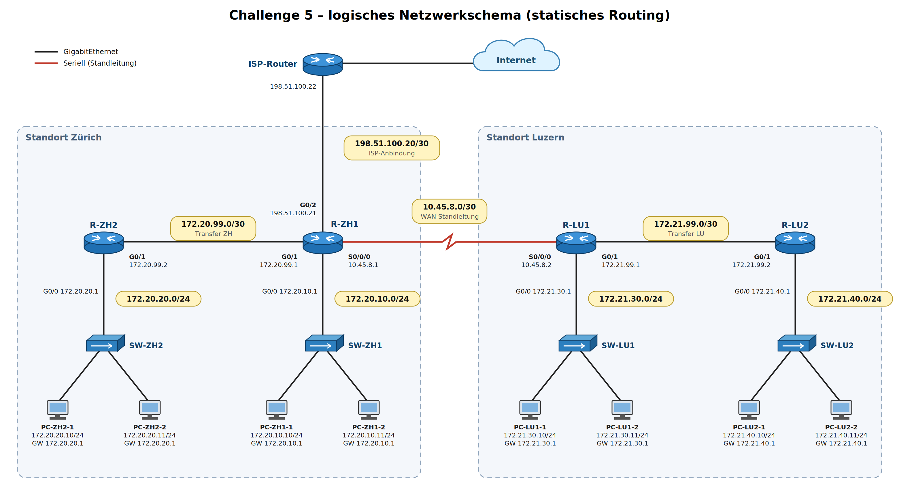

# Challenge 5 - Routing-Challenge (statisches Routing)

**Modul:** M129, Unterrichtsblock 5
**Datum:** 21.09.2026

Die Challenge wurde mit dem vorgegebenen KI-Prompt individuell generiert. Zuerst kommt die Aufgabenstellung so wie ich sie erhalten habe, danach meine Lösung.

---

# Aufgabenstellung

## 1. Topologie



Die Aufgabe kam als ASCII-Diagramm, für die Besprechung habe ich daraus das logische Netzwerkschema oben gezeichnet.

## 2. Netzwerke

| Netz | Adresse | Standort | Beschreibung |
|---|---|---|---|
| LAN ZH1 | 172.20.10.0/24 | Zürich | LAN am Standortrouter R-ZH1 |
| LAN ZH2 | 172.20.20.0/24 | Zürich | LAN am zusätzlichen Router R-ZH2 |
| Transfer ZH | 172.20.99.0/30 | Zürich | R-ZH1 - R-ZH2 |
| LAN LU1 | 172.21.30.0/24 | Luzern | LAN am Standortrouter R-LU1 |
| LAN LU2 | 172.21.40.0/24 | Luzern | LAN am zusätzlichen Router R-LU2 |
| Transfer LU | 172.21.99.0/30 | Luzern | R-LU1 - R-LU2 |
| WAN | 10.45.8.0/30 | - | Standleitung R-ZH1 - R-LU1 (seriell) |
| ISP | 198.51.100.20/30 | Zürich | Internetanbindung R-ZH1 - ISP |

## 3. Router und Interfaces

| Router | Interface | IP-Adresse | Netz |
|---|---|---|---|
| R-ZH1 | G0/0 | 172.20.10.1/24 | LAN ZH1 |
| R-ZH1 | G0/1 | 172.20.99.1/30 | Transfer ZH |
| R-ZH1 | G0/2 | 198.51.100.21/30 | ISP |
| R-ZH1 | S0/0/0 | 10.45.8.1/30 | WAN |
| R-ZH2 | G0/0 | 172.20.20.1/24 | LAN ZH2 |
| R-ZH2 | G0/1 | 172.20.99.2/30 | Transfer ZH |
| R-LU1 | G0/0 | 172.21.30.1/24 | LAN LU1 |
| R-LU1 | G0/1 | 172.21.99.1/30 | Transfer LU |
| R-LU1 | S0/0/0 | 10.45.8.2/30 | WAN |
| R-LU2 | G0/0 | 172.21.40.1/24 | LAN LU2 |
| R-LU2 | G0/1 | 172.21.99.2/30 | Transfer LU |
| ISP-Router | - | 198.51.100.22/30 | ISP |

Die Hosts verwenden jeweils die .1 ihres LANs als Standardgateway. R-ZH1 macht NAT Richtung Internet, der ISP-Teil ist nicht Gegenstand der Aufgabe und funktioniert fehlerfrei.

## 4. Routingtabellen

**R-ZH1**

| Typ | Zielnetz | Next Hop | Interface |
|---|---|---|---|
| C | 172.20.10.0/24 | direkt | G0/0 |
| C | 172.20.99.0/30 | direkt | G0/1 |
| C | 198.51.100.20/30 | direkt | G0/2 |
| C | 10.45.8.0/30 | direkt | S0/0/0 |
| S | 172.20.20.0/24 | 172.20.99.2 | G0/1 |
| S | 172.21.30.0/24 | 10.45.8.2 | S0/0/0 |
| S | 172.21.40.0/24 | 10.45.8.2 | S0/0/0 |
| S | 172.21.99.0/30 | 10.45.8.2 | S0/0/0 |
| S* | 0.0.0.0/0 | 198.51.100.22 | G0/2 |

**R-ZH2**

| Typ | Zielnetz | Next Hop | Interface |
|---|---|---|---|
| C | 172.20.20.0/24 | direkt | G0/0 |
| C | 172.20.99.0/30 | direkt | G0/1 |
| S* | 0.0.0.0/0 | 172.20.99.1 | G0/1 |

**R-LU1**

| Typ | Zielnetz | Next Hop | Interface |
|---|---|---|---|
| C | 172.21.30.0/24 | direkt | G0/0 |
| C | 172.21.99.0/30 | direkt | G0/1 |
| C | 10.45.8.0/30 | direkt | S0/0/0 |
| S | 172.21.40.0/24 | 172.21.99.2 | G0/1 |
| S | 172.20.10.0/24 | 10.45.8.1 | S0/0/0 |
| S | 172.20.20.0/24 | 172.21.99.2 | G0/1 |
| S | 172.20.99.0/30 | 10.45.8.1 | S0/0/0 |
| S* | 0.0.0.0/0 | 10.45.8.1 | S0/0/0 |

**R-LU2**

| Typ | Zielnetz | Next Hop | Interface |
|---|---|---|---|
| C | 172.21.40.0/24 | direkt | G0/0 |
| C | 172.21.99.0/30 | direkt | G0/1 |
| S* | 0.0.0.0/0 | 172.21.99.1 | G0/1 |

## Teil A - Routing-Verständnis

1. Wie viele IP-Netze umfasst die Topologie und welche davon sind Transfernetze?
2. Weshalb werden für die Verbindungen zwischen den Routern /30-Netze verwendet? Wie viele Hosts sind darin möglich?
3. Welcher Router ist für die Internetanbindung zuständig und woran erkennt man das in den Routingtabellen?
4. Weshalb kommen R-ZH2 und R-LU2 mit nur einer statischen Route aus?
5. Was bedeuten die Kennzeichnungen C, S und S* in den Routingtabellen?
6. Welchen Eintrag verwendet R-LU1 für ein Paket an 8.8.8.8 und welchen für ein Paket an 172.20.10.50? Begründe.
7. Beschreibe den Weg (alle Router mit Interfaces) eines Pakets von 172.21.40.10 nach 172.20.10.10.
8. Beschreibe den Weg eines Pakets von 172.20.20.10 ins Internet.

## Teil B - Fehleranalyse und Korrektur

1. Ein Host 172.21.40.10 pingt 172.20.20.10. Verfolge das Paket Router für Router. Was passiert?
2. Welche Kommunikationsbeziehungen sind betroffen, welche funktionieren? Erstelle eine Übersicht.
3. Welchen Fehler würde ein traceroute bzw. ping anzeigen?
4. Finde den fehlerhaften Eintrag und begründe, warum er falsch ist.
5. Gib die korrekten Cisco-Befehle zur Behebung an.
6. Weshalb funktioniert die Verbindung 172.20.20.10 -> Internet trotzdem, obwohl sie ebenfalls das Netz 172.20.20.0/24 betrifft?

---

# Lösung

## Teil A

**A1:** Es sind 8 Netze: 4 LANs (172.20.10.0/24, 172.20.20.0/24, 172.21.30.0/24, 172.21.40.0/24) und 4 Transfernetze (172.20.99.0/30, 172.21.99.0/30, 10.45.8.0/30 und das ISP-Netz 198.51.100.20/30).

**A2:** Zwischen zwei Routern braucht es genau 2 Adressen. Ein /30 hat 4 Adressen, davon 2 nutzbare Hosts (Netz- und Broadcastadresse fallen weg). So verschwendet man keine Adressen.

**A3:** R-ZH1. Nur R-ZH1 hat ein Interface ins ISP-Netz (G0/2) und seine Defaultroute zeigt auf den ISP-Router 198.51.100.22. Alle anderen Router zeigen mit ihrer Defaultroute (direkt oder über Umweg) Richtung R-ZH1.

**A4:** R-ZH2 und R-LU2 sind Stub-Router, sie haben nur einen einzigen Weg nach aussen (zum jeweiligen Standortrouter). Darum reicht eine Defaultroute, alles was nicht direkt angeschlossen ist, geht sowieso zum Standortrouter.

**A5:** C = connected (direkt angeschlossenes Netz), S = static (von Hand eingetragen), S* = statische Defaultroute (Gateway of last resort).

**A6:** 8.8.8.8 passt auf keinen spezifischen Eintrag, darum nimmt R-LU1 die Defaultroute 0.0.0.0/0 -> 10.45.8.1 (S0/0/0). Für 172.20.10.50 passt der Eintrag 172.20.10.0/24 -> 10.45.8.1, weil /24 spezifischer ist als /0 (Longest Prefix Match).

**A7:** 172.21.40.10 -> Gateway R-LU2 (G0/0) -> Defaultroute -> R-LU2 G0/1 -> R-LU1 G0/1 -> Eintrag 172.20.10.0/24 -> R-LU1 S0/0/0 -> R-ZH1 S0/0/0 -> direkt angeschlossen -> R-ZH1 G0/0 -> 172.20.10.10. Das sind 3 Router (R-LU2, R-LU1, R-ZH1).

**A8:** 172.20.20.10 -> R-ZH2 G0/0 -> Defaultroute -> R-ZH2 G0/1 -> R-ZH1 G0/1 -> Defaultroute -> R-ZH1 G0/2 -> ISP-Router 198.51.100.22 -> Internet.

## Teil B

**B1: Paketverfolgung 172.21.40.10 -> 172.20.20.10**

1. PC schickt ans Gateway R-LU2 (172.21.40.1).
2. R-LU2 kennt 172.20.20.0/24 nicht, nimmt die Defaultroute -> 172.21.99.1 (R-LU1).
3. R-LU1 hat den Eintrag 172.20.20.0/24 -> **172.21.99.2**, schickt das Paket also wieder zurück an R-LU2.
4. R-LU2 nimmt wieder die Defaultroute -> R-LU1.
5. Das Paket pendelt zwischen R-LU1 und R-LU2 hin und her (**Routing-Schleife**), bei jedem Hop wird die TTL um 1 kleiner. Bei TTL 0 wird das Paket verworfen und der Router schickt eine ICMP-Meldung "Time Exceeded" an den Absender.

**B2: Übersicht Erreichbarkeit**

| Von \ Nach | LAN ZH1 | LAN ZH2 | LAN LU1 | LAN LU2 | Internet |
|---|---|---|---|---|---|
| LAN ZH1 | ✓ | ✓ | ✓ | ✓ | ✓ |
| LAN ZH2 | ✓ | ✓ | ✗ | ✗ | ✓ |
| LAN LU1 | ✓ | ✗ | ✓ | ✓ | ✓ |
| LAN LU2 | ✓ | ✗ | ✓ | ✓ | ✓ |

Betroffen ist also jede Kommunikation zwischen dem Netz 172.20.20.0/24 und dem ganzen Standort Luzern, in **beide Richtungen**. Von ZH2 nach LU kommt der Request zwar an (R-ZH1 hat die richtigen Routen), die Antwort bleibt aber in der Schleife bei R-LU1/R-LU2 hängen. Ein Ping braucht immer Hin- **und** Rückweg.

**B3:** Ein ping von 172.21.40.10 auf 172.20.20.10 bringt "TTL expired in transit" (Reply from 172.21.99.1 bzw. .2). Ein traceroute zeigt die Adressen 172.21.40.1, 172.21.99.1, 172.21.99.2, 172.21.99.1, 172.21.99.2, ... also immer abwechselnd die beiden Luzerner Router, bis das Maximum an Hops erreicht ist. Ein ping von ZH2 nach LU bringt nur "Request timed out", weil die Antwort nie zurückkommt.

**B4: Fehlerhafter Eintrag**

Auf **R-LU1**: `172.20.20.0/24 via 172.21.99.2 (G0/1)`

Das Netz 172.20.20.0/24 liegt in Zürich hinter R-ZH1 und R-ZH2. R-LU1 schickt es aber Richtung R-LU2, also in die falsche Richtung. R-LU2 ist ein Stub-Router und kennt das Netz auch nicht, darum schickt er es über seine Defaultroute wieder zurück zu R-LU1. Richtig wäre der Next Hop 10.45.8.1 (R-ZH1) über S0/0/0, genau wie bei den anderen Zürcher Netzen. R-ZH1 kennt das Netz dann und leitet es an 172.20.99.2 (R-ZH2) weiter.

Interessant: Ohne diesen Eintrag würde es sogar funktionieren, weil dann die Defaultroute von R-LU1 (auch 10.45.8.1) greifen würde. Der falsche spezifische Eintrag gewinnt aber wegen Longest Prefix Match gegen die Defaultroute.

**B5: Korrektur auf R-LU1**
```
enable
configure terminal
no ip route 172.20.20.0 255.255.255.0 172.21.99.2
ip route 172.20.20.0 255.255.255.0 10.45.8.1
end
copy running-config startup-config
```
Kontrolle mit `show ip route` auf R-LU1 und danach ping/traceroute von 172.21.40.10 nach 172.20.20.10. Erwarteter traceroute danach: 172.21.40.1 -> 172.21.99.1 -> 10.45.8.1 -> 172.20.99.2 -> 172.20.20.10.

**B6:** Weil der Verkehr von 172.20.20.10 ins Internet gar nie über R-LU1 läuft. Der Weg geht R-ZH2 -> R-ZH1 -> ISP und die Antwort kommt vom ISP über R-ZH1 (hat den richtigen Eintrag 172.20.20.0/24 -> 172.20.99.2) zurück. Der fehlerhafte Eintrag wirkt nur auf Pakete, die bei R-LU1 ankommen und nach 172.20.20.0/24 wollen.

---

## Fazit

Die Challenge hat gut gezeigt, dass ein einziger falscher Next Hop reicht, um ein ganzes Netz für einen Standort unerreichbar zu machen, und dass so ein Fehler sogar eine Routing-Schleife auslösen kann. Wichtig war vor allem, den Weg eines Pakets Router für Router durchzugehen und dabei auch an den Rückweg zu denken. Das Topologiebild habe ich aus den Angaben der Aufgabe als logisches Netzwerkschema gezeichnet.
